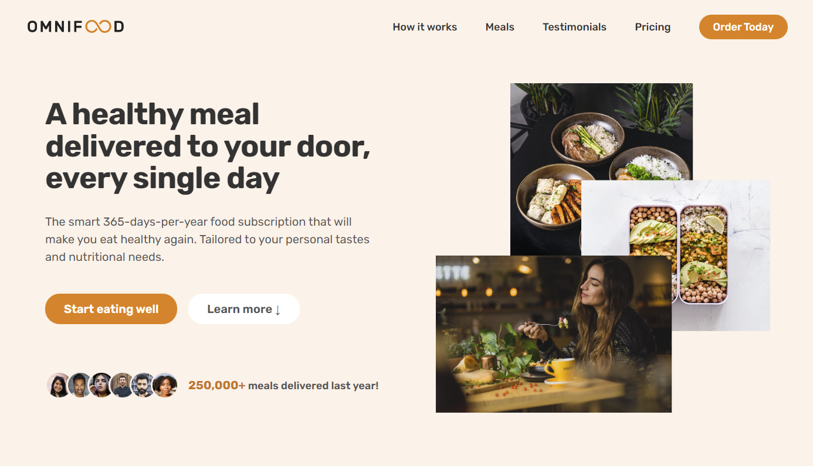
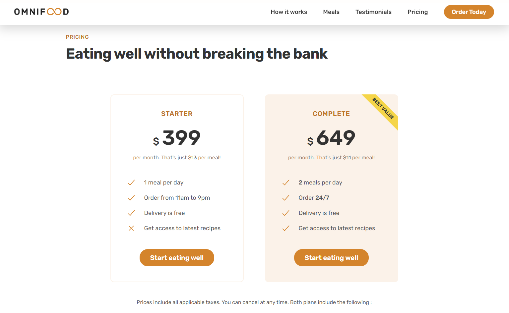
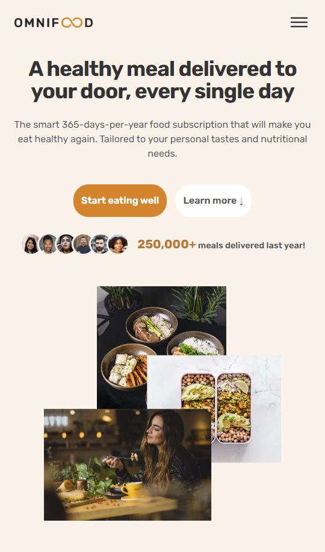
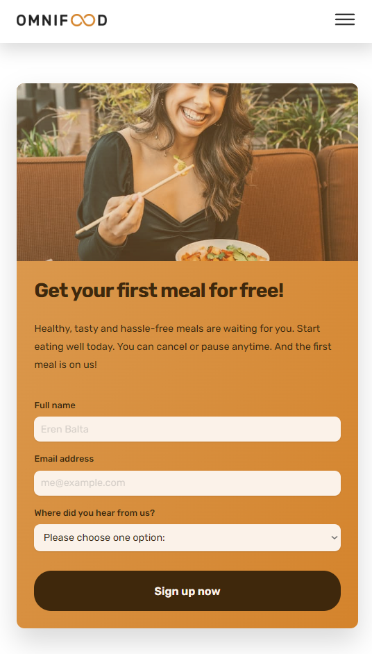

# 👋 Full Responsive Website by Using HTML5 , CSS3, and beginner level JS

## Welcome! 👋

Thanks for checking out this repository.

This is a project that I have developed my Responsive Webpage skills.

You can reach the Live Site here : [Click here !](https://erenymo.github.io/food-based-website/) 

## I have used 

In this project:
Semantic HTML5
CSS3 - CSS Grid, Flexbox
JavaScript - beginner level

## Screenshots

# Desktop Design

# Mobile Design

 
